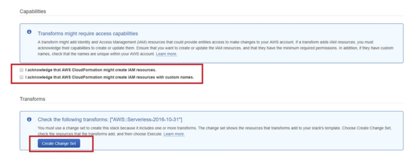
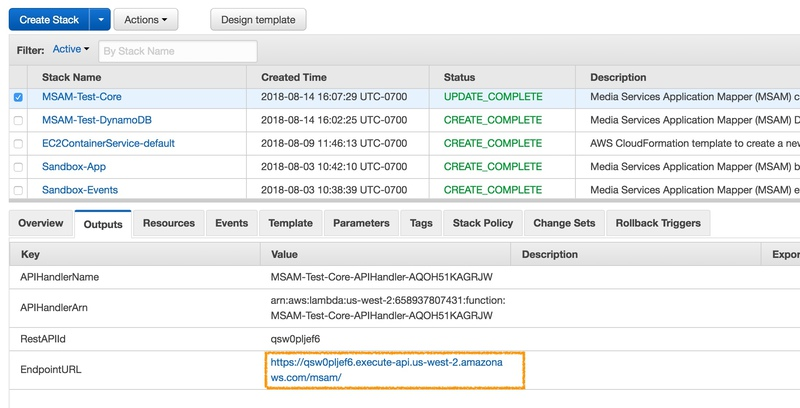
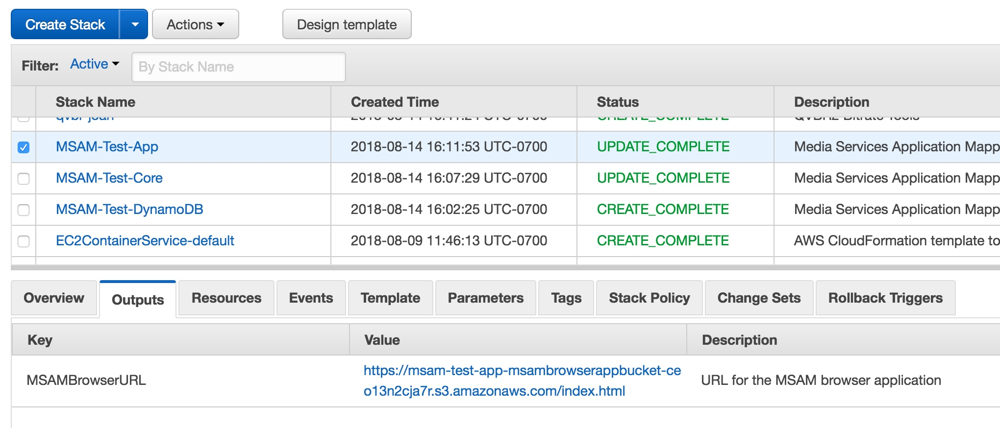
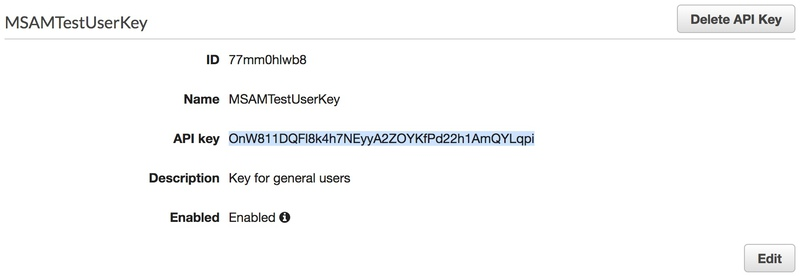

# Media Services Application Mapper (MSAM)

MSAM is installed into an AWS account using several CloudFormation templates.

## Requirements for MSAM

* Amazon Web Services account with root or Administrator permissions
* Google Chrome, Mozilla Firefox, Safari or another current browser with JavaScript enabled


## Important Notes

**CloudFront:** MSAM v1.5.0 and up installs a CloudFront distribution with the web application while the S3 bucket that hosts the content remains private. The first time installing the web application may take as long as **25 minutes** for the CloudFront distribution to complete the deployment process.

**DNS Temporary Redirect:** You may receive DNS redirects from CloudFront **if you install into a region other an us-east-1.** This is normal and may take from several minutes to an hour for DNS changes to propagate throughout the network. You may see the following message in your browser, which is normal while DNS changes settle. You will not need to take any other action aside from waiting. Read [this](https://docs.aws.amazon.com/AmazonS3/latest/dev/Redirects.html#TemporaryRedirection) at AWS for more information about this case.


## Finding Installation Content

### dist/ folder in GitHub

This folder in the repository contains files you can use to install MSAM into your AWS account. 

The four CloudFormation templates located in this folder that end with `-release.json` are ready to use to install the latest release of MSAM.

```
msam-all-resources-release.json
msam-browser-app-release.json
msam-core-release.json
msam-dynamodb-release.json
msam-events-release.json
```

### md5.txt, sha1.txt, sha256.txt

These files contain digest values for the templates and packaged code contained in this folder and hosted on S3 by the project sponsors.

### release.txt

The hosted templates listed in this file always point to the latest release of MSAM. These links can be used directly in the CloudFormation console to install MSAM into any supported AWS region. Templates in this file have an epoch timestamp embedded in the template description. You will see the timestamp after the template is loaded by CloudFormation. These template URLs should never change name.

```
https://rodeolabz-us-west-2.s3.amazonaws.com/msam/msam-all-resources-release.json
https://rodeolabz-us-west-2.s3.amazonaws.com/msam/msam-browser-app-release.json
https://rodeolabz-us-west-2.s3.amazonaws.com/msam/msam-core-release.json
https://rodeolabz-us-west-2.s3.amazonaws.com/msam/msam-dynamodb-release.json
https://rodeolabz-us-west-2.s3.amazonaws.com/msam/msam-events-release.json
```

### current.txt

The templates listed in this file point to a build of MSAM under development or test. Templates in this file have an epoch timestamp in the file name and embedded in the template description. The template URLs below are example only. This file is regenerated by MSAM's deployment scripts when testing a new build.

```
https://rodeolabz-us-west-2.s3.amazonaws.com/msam/msam-all-resources-release-1581034203.template
https://rodeolabz-us-west-2.s3.amazonaws.com/msam/msam-browser-app-release-1581034203.template
https://rodeolabz-us-west-2.s3.amazonaws.com/msam/msam-core-release-1581034203.template
https://rodeolabz-us-west-2.s3.amazonaws.com/msam/msam-dynamodb-release-1581034203.template
https://rodeolabz-us-west-2.s3.amazonaws.com/msam/msam-events-release-1581034203.template
```

## CloudFormation Stack Creation

* Login to CloudFormation using the same account used for creating and managing the Media Services
* Click on Create Stack

During the installation of the CloudFormation stacks you may be prompted to acknowledge creation of IAM resources, as seen in the sample screenshot below. Click the check-box next to each entry. Finally, click the "Create Change Set" button where applicable, then press the Execute button.
 


When you are installing a CloudFormation template listed below, from Choose a Template select "Specify an Amazon S3 template URL" and paste in the URL below exactly as provided for any MSAM-supported region. Do not change the region name in the URL path or bucket name.

### Master Template: All Resources

As of release v1.5.0, the CloudFormation templates distributed for MSAM include a master template that installs the complete solution into a single region. The master template nests and deploys the existing four templates automatically.

`https://rodeolabz-us-west-2.s3.amazonaws.com/msam/msam-all-resources-release.json`

#### Input Parameters

1. Provide a stack name
2. Specify the time-to-live in seconds for all cached data, alarms, and events; see the examples next to the input for common values

#### Outputs

Go to the Outputs section of the stack, and copy and save the URL value for EndpointURL and MSAMBrowserURL. Open the link for the APIKeyID, click the Show link in the main compartment for the API key, copy the API Key and save it with the other two URL values.


After the template installation finishes and you've recorded the outputs from the template, skip forward to [Template 3: CloudFormation for the Event Handler](INSTALL.md#template-3-cloudformation-for-the-event-handler) if you need to collect events from multiple regions, and then to [Multiple Users and Access Control](INSTALL.md#multiple-users-and-access-control) and complete the final steps in this guide.

### Individual Templates

You still have the option to install CloudFormation templates separately. This may be an option for you if you are performing a customized installation that requires special handling between stacks.

The order in which to create the stacks are as follows:

1. Create DynamoDB stack
1. Create Core stack
1. Create Event Handler stack
1. Create MSAM Web stack 

Install the DynamoDB, Core and Web stacks in your main, or most accessed region only. The Event Handler stack is installed in each region Media Services are configured.

**After installing the DynamoDB stack (Template 1), you can install the remaining stacks (Templates 2, 3, and 4) concurrently. There is no need to wait for each to finish before starting the next.**

### Template 1: CloudFormation for the DynamoDB Tables

This template will create a stack for the tables, indices, and on demand capacity settings. The first time a stack is created from this template, defaults are added to scan and display cloud resources in the current region only. These settings can be updated in the tool to expand the inventory coverage to other regions.

`https://rodeolabz-us-west-2.s3.amazonaws.com/msam/msam-dynamodb-release.json`

#### Input Parameters

1. Provide a stack name

#### Outputs

Go to the Outputs section of the stack and copy the six table names to a notepad. You will need these as input parameters for the next templates. See the following image.


### Template 2: CloudFormation for the Core API of MSAM

This template will create a stack for the MSAM REST API, and periodic tasks used to refresh the content cache and discover logical resource connections.

`https://rodeolabz-us-west-2.s3.amazonaws.com/msam/msam-core-release.json`

#### Input Parameters

1. Provide a stack name
2. Paste each of the table names that were generated from the previous stack
3. Specify a content cache maximum age; content not refreshed before this time will be removed from the cache

#### Outputs

Go to the Outputs section after the stack if created and copy the EndpointUrl to a notepad. See the following image for the location of the URL.



### Template 3: CloudFormation for the Event Handler

This template is used to create a stack with the Lambda responsible for receiving events from Media Services resources, such as MediaLive pipeline alerts. Create a stack for this template in every region you will be creating Media Services resources.

`https://rodeolabz-us-west-2.s3.amazonaws.com/msam/msam-events-release.json`

#### Input Parameters

1. Provide a stack name
2. Paste the Events table name that was generated from the DynamoDB stack
3. Specify the region of the Events table (such as us-west-2, us-east-1, or eu-west-1, for example)
4. Specify the time-to-live in seconds all events; see the examples next to the input

#### Outputs

None

### Template 4: CloudFormation for the Browser Application

This template will install a copy of the MSAM browser application into an S3 bucket. Files added by the CloudFormation template will have their ACL set to `public-read` to allow access over HTTPS.

`https://rodeolabz-us-west-2.s3.amazonaws.com/msam/msam-browser-app-release.json`

### Input Parameters

1. Provide a stack name

### Outputs

Go to the Outputs section of the created stack and copy the MSAMBrowserURL to a notepad. This is the URL to start the application on your workstation. See the following image for the location of the URL.



## Retrieve the API Key for the REST API

The MSAM back-end requires an API key to access any of the REST endpoints. The Core API CloudFormation template creates a default API key automatically. The key is not displayed in Outputs section of the created stack. You can retrieve the key from the AWS console. **By default, no access is possible until the following steps are performed.**

1. Change to the Resources tab of the Core API stack
2. Click the link for the API Key in the Physical ID column of the Resources listing
3. Click the Show link in the main compartment for the API key
6. Copy the API Key and keep it with the Endpoint URL
  


### Multiple Users and Access Control

**You can create multiple API keys, each with different names that are provided to separate groups.**

Note that if you want to share the UI with a colleague you can do so easily by providing the browser application URL, core endpoint URL and an API key. If an API key is stolen or lost, create a new API key and delete the previous one. All users that require access can be sent the updated API key that they will have to update in the browser application. MSAM will prompt the user to update the endpoint and key if the previously used settings are unable to access the back-end.

## Start the MSAM UI 

**Wait about 5-10 minutes for the first data gathering of the services and connection mapping to complete. This is needed only the first time after creation of the MSAM instance.**

Continue to the [Usage](USAGE.md) guide to start using the tool.

### Optional Parameters

As of 1.5.0, the MSAM browser URL is the root of a CloudFront distribution URL. For example:

`https://d1c8z4f93zrlmx.cloudfront.net/`

The following parameters can be used with the URL to customize the start-up of the browser tool.

1. **diagram** -- The name of a diagram to show right after start-up
2. **endpoint** -- The endpoint URL to use for the connection
3. **key** -- The API to use with the chosen endpoint URL

#### Examples

Show a default diagram named Livestream on start-up

`https://d1c8z4f93zrlmx.cloudfront.net/?diagram=Livestream`

Automatically connect to an endpoint with an API key

`https://d1c8z4f93zrlmx.cloudfront.net/?endpoint=https://oplfnxzh7l.execute-api.us-east-1.amazonaws.com/msam/&key=69ZSAV3tBX7YYfh1XTcsq2fLcE7Z0ETY4JXclqJJ`

**NOTE: This above parameters should only be used for secure or demonstration environments. Anyone with this URL can connect and use MSAM.**


## DynamoDB Considerations

There are six DynamoDB tables used by MSAM. They are:

* [StackName]-Alarms-[ID]
* [StackName]-Channels-[ID]
* [StackName]-Content-[ID]
* [StackName]-Events-[ID]
* [StackName]-Layout-[ID]
* [StackName]-Settings-[ID]

Each table is configured for on-demand capacity by the CloudFormation template. This allows MSAM to automatically scale it's data handling capacity from small to very large Media Services installations.


## Versions and Updates

Each template includes a timestamp that indicates it's revision level. The timestamp is shown in the description of each template.

```
Media Services Application Mapper (MSAM) browser application (ID: 1537396573)
Media Services Application Mapper (MSAM) cloud API (ID: 1537396573)
```

You can also view the build timestamp in the tool by selecting the Tools menu and MSAM Build Numbers menu item. A dialog box will show the timestamps of each component and show a warning if they are seven or more days apart.

Any updates provided will be done via updates to the CloudFormation template files. In the CloudFormation console, click on the specific stack to be updated. From the top-right select Update Stack and point it to the stack link, check the IAM resource check boxes (if they are applicable to this specific update), and update the stack. 

## Raw Web Content

The MSAM browser application in zipped form is available from the following URL. The numeric value at the end of this file is the same as other files from the same build.

`https://s3-us-west-2.amazonaws.com/rodeolabz-us-west-2/msam/msam-web-NNNNNNNNNN.zip`

This file can be extracted into a web server or another type of hosting environment. Take this approach if you prefer not to use the CloudFormation template to host the application in an S3 bucket.

## Navigate

Navigate to [README](README.md) | [Workshop](WORKSHOP.md) | [Install](INSTALL.md) | [Usage](USAGE.md) | [Uninstall](UNINSTALL.md) | [Rest API](REST_API.md)