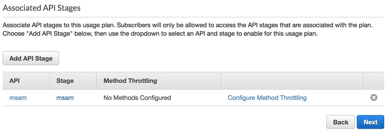

# Media Services Application Mapper (MSAM)

MSAM is installed into an AWS account using several CloudFormation templates.

## Requirements for MSAM

* Amazon Web Services account with root or Administrator permissions
* Google Chrome, Mozilla Firefox, or another current browser with JavaScript enabled

## CloudFormation Stack Creation

The order in which to create the stacks are as follows:

1. Create DynamoDB stack
1. Create Core stack
1. Create Event Handler stack
1. Create MSAM Web stack 

Install the DynamoDB, Core and Web stacks in your main, or most accessed region only. The Event Handler stack is installed in each region Media Services are configured.

During the installation of the different CloudFormation stacks you may be prompted to acknowledge creation of IAM resources, as seen in the sample screenshot below. Click the check-box next to each entry. Finally, click the "Create Change Set" button where applicable, then press the Execute button.
 


* Login to CloudFormation using the account used for creating / managing the MediaServices.
* Click on Create Stack

For each of the four stacks listed below, from Choose a Template select "Specify an Amazon S3 template URL" and paste in the URLs as provided.

### Template 1: CloudFormation for the DynamoDB Tables

This template will create a stack for the tables, indices, and capacity autoscaling rules.

`https://s3-us-west-2.amazonaws.com/rodeolabz-us-west-2/msam/msam-dynamodb-release.json`

#### Input Parameters

1. Provide a stack name

#### Outputs

Go to the Outputs section of the stack and copy the six table names to a notepad. You will need these as input parameters for the next templates. See the following image.


### Template 2: CloudFormation for the Core API of MSAM

This template will create a stack for the MSAM REST API, and periodic tasks used to refresh the content cache and discover logical resource connections.

`https://s3-us-west-2.amazonaws.com/rodeolabz-us-west-2/msam/msam-core-release.json`

#### Input Parameters

1. Provide a stack name
2. Paste each of the table names that were generated from the previous stack
3. Specify a content cache maximum age; content not refreshed before this time will be removed from the cache

#### Outputs

Go to the Outputs section after the stack if created and copy the EndpointUrl to a notepad. See the following image for the location of the URL.


### Template 3: CloudFormation for the Event Handler

This template is used to create a stack with the Lambda responsible for receiving events from Media Services resources, such as MediaLive pipeline alerts. Create a stack for this template in every region you will be creating Media Services resources.

`https://s3-us-west-2.amazonaws.com/rodeolabz-us-west-2/msam/msam-events-release.json`

#### Input Parameters

1. Provide a stack name
2. Paste the Events table name that was generated from the DynamoDB stack
3. Specify the region of the Events table (such as us-west-2, us-east-1, or eu-west-1, for example)
4. Specify the time-to-live in seconds all events; see the examples next to the input

#### Outputs

None

### Template 4: CloudFormation for the Browser Application

This template will install a copy of the MSAM browser application into a publicly accessible S3 bucket. 

`https://s3-us-west-2.amazonaws.com/rodeolabz-us-west-2/msam/msam-browser-app-release.json`

### Input Parameters

1. Provide a stack name

### Outputs

Go to the Outputs section of the created stack and copy the MSAMBrowserURL to a notepad. This is the URL to start the application on your workstation. See the following image for the location of the URL.


## Configure API Key Authentication

MSAM is secure after installation because it requires an API key to access any of the REST API endpoints, and the CloudFormation template doesn't create API keys automatically. **By default, no access is possible until the following steps are performed.**

1. Go to the API Gateway console
1. In the left-hand tree view, click on Usage Plans and create a new usage plan. Give it a descriptive name, e.g. MSAMUsagePlan
1. Disable Throttling and Quota for now and considering activing one or both later depending on your environment and users
1. Click on the newly created usage plan and then click on the **Add API Stage** button
1. From the API dropdown select **msam**
1. From the Stage dropdown select **msam**
1. Click the checkbox to save the stage to the usage plan



1. Click Next
1. On the next page, click **Create API Key and add to Usage Plan** button
1. Give the new key a name and description, and leave **Auto Generate** selected
1. Click Save, and click Done on the API key page
1. Select the API Keys tab
1. Click on the API Key and click the **Show** option to see the actual API Key
1. Copy the API Key
  


### Multiple Users and Access Control

**You can create multiple API keys, each with different names that are provided to separate groups.**

Note that if you want to share the UI with a colleague you can do so easily by providing the browser application URL, core endpoint URL and an API key. If an API key is compromised, or lost, create a new API key and delete the previous one. All users that require access can be sent the updated API key that they will have to update in the browser application under the Settings menu and Connections Settings menu item.

MSAM will prompt the user to update a connection if it fails to contact the API successfully.

## Start the MSAM UI 

**Wait about 5-10 minutes for the first data gathering of the services to complete. This is needed only the first time after creation of the MSAM instance.**

Continue to the [Usage](USAGE.md) guide to start using the tool.

## DynamoDB Considerations

There are six DynamoDB tables used by MSAM. They are:

* [StackName]-Alarms-[ID]
* [StackName]-Channels-[ID]
* [StackName]-Content-[ID]
* [StackName]-Events-[ID]
* [StackName]-Layout-[ID]
* [StackName]-Settings-[ID]

Each table is configured for auto scaling by the CloudFormation template. The default DynamoDB read and write capacity set by the CloudFormation template is 5. Each table is set to scale out when recent operations exceed 50% of its R/W capacity. Each table is limited to scale out to 5,000 R/W capacity units if needed. Each table will automatically scale in when R/W capacity needs reduce.

Consider setting alarms and notify via email or text message if any throttling events occur on any table, if any of these tables breach the 75% level of their current capacity, or if any table exceeds a certain R/W capacity unit level.

## Versions and Updates

Each template includes a timestamp that indicates it's revision level. The timestamp is shown in the description of each template.

```
Media Services Application Mapper (MSAM) browser application (ID: 1537396573)
Media Services Application Mapper (MSAM) cloud API (ID: 1537396573)
```

You can also view the build timestamp in the tool by selecting the Tools menu and MSAM Build Numbers menu item. A dialog box will show the timestamps of each component and show a warning if they are seven or more days apart.

Any updates provided will be done via updates to the CloudFormation template files. In the CloudFormation console, click on the specific stack to be updated. From the top-right select Update Stack and point it to the stack link, check the IAM resource check boxes (if they are applicable to this specific update), and update the stack. 

## Raw Web Content

The MSAM browser application in zipped form is available from the following URL.

`https://s3-us-west-2.amazonaws.com/rodeolabz-us-west-2/msam/msam-web.zip`

This file can be extracted into a web server or another type of hosting environment. Take this approach if you prefer not to use the CloudFormation template to host the application in an S3 bucket.

## Navigate

Navigate to [README](README.md) | [Workshop](WORKSHOP.md) | [Install](INSTALL.md) | [Usage](USAGE.md) | [Uninstall](UNINSTALL.md)
