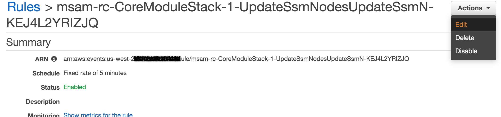
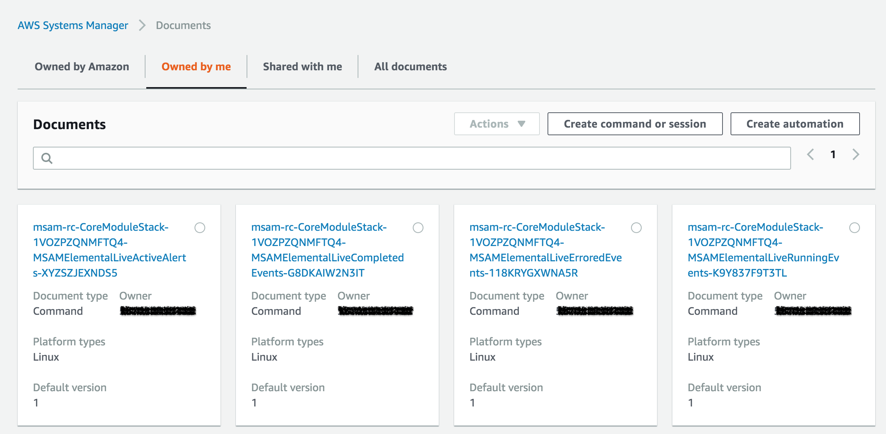

# Managed Instances on MSAM
MSAM can inventory and display EC2 and Hybrid systems that are managed by AWS Systems Manager (SSM). A hybrid system may be a physical host located in an on-premise data center that can be managed from the cloud. 

## AWS System Manager Agent(SSM Agent) 
The SSM Agent is an Amazon software that must be installed and configured on an Amazon EC2 instance, an on-premises server, or a virtual machine (VM), if you want SSM to manage a given instance.

### SSM on EC2s
Certain Amazon Machine Images for EC2s come pre-installed with the agent but you must **attach an IAM instance profile to an Amazon EC2 instance** as described in [this document](https://docs.aws.amazon.com/systems-manager/latest/userguide/setup-launch-managed-instance.html). 

### SSM on Hybrid systems
To install the SSM agent on Hybrid systems like an Elemental Live encoder, which runs either a CentOS or RHEL operating system, follow the instructions below:
1. [Create a managed-instance activation for a hybrid environment](https://docs.aws.amazon.com/systems-manager/latest/userguide/sysman-managed-instance-activation.html)
1. [Install SSM Agent for a hybrid environment (Linux)](https://docs.aws.amazon.com/systems-manager/latest/userguide/sysman-install-managed-linux.html)

Once the systems have been installed and configured, they should show up in the SSM console under Managed Instances. See below:

### Updating the SSM Agent

The agent can be [set to auto-update](https://docs.aws.amazon.com/systems-manager/latest/userguide/ssm-agent-automatic-updates.html) from the SSM console. However, note that if something should go wrong during the update, then it is up to the user to [check for logs](https://docs.aws.amazon.com/systems-manager/latest/userguide/sysman-agent-logs.html) in the managed systems. 
Some indicators that something might not have gone quite right:
1. In the SSM console, your managed instances are not showing as **Online** in their **Ping Status**
1. Metrics are not available for [Elemental Live encoders](#support-for-elemental-live-encoders)

## Caching Managed Instance Resources
MSAM checks for and caches managed instances every 5 minutes by default. This default can be overriden, but checking for managed instance inventory is a heavy API call and it is not recommended to run this very often. 

To override the default:
1. Log on to the CloudWatch console.
1. On the left hand navigation pane under **Events**, select **Rules**.
1. Locate the event rule with **UpdateSsmNodes** in the name. Click on this rule.
1. Click on the **Actions** dropdown, and select **Edit**.   
    
1. Update the **Schedule** to the desired rate.
1. Click on **Configure Details**. 
1. Click on **Update Rule**. 

## Tagging SSM Managed EC2 and Hybrid Resources

Refer to [this guide]( https://github.com/awslabs/aws-media-services-application-mapper/blob/master/RESOURCE_TAGS.md#ssm-managed-ec2-and-hybrid-resources) on tagging your managed instance resources.

## [Support for Elemental Live Encoders](#support-for-elemental-live-encoders)

Hybrid resources that have the tag:

`MSAM-NodeType: ElementalLive` 

are treated as an Elemental Live encoder by MSAM and have additional support.

### CloudWatch Metrics

A number of CloudWatch Metrics are automatically created for managed instances that are identified as Elemental Live encoders (via the MSAM-NodeType tag). Metrics are written to a custom namespace called **MSAM/SSMRunCommand** by Instance IDs. 

The following metrics are currently supported and published:
* MSAMElementalLiveCompletedEvents - number of Elemental Live events in the completed status
* MSAMElementalLiveErroredEvents - number of Elemental Live events in the errored status
* MSAMElementalLiveRunningEvents - number of Elemental Live events in the running status
* MSAMElementalLiveActiveAlerts - number of active alerts as shown in the Alerts tab of the encoder
* MSAMElementalLiveStatus (is the Elemental encoder process running) - either 1 (for running) or 0 (not running)
* MSAMSsmSystemStatus (is the encoder up/reachable at all) - either 1 (reachable) or 0 (not reachable)

Separate metrics are created whenever SSM commands fail or time out:
* MSAMSsmCommandFailed - adds a count whenever an SSM command fails
* MSAMSsmCommandTimedOut- adds a count whenever an SSM command times out

**NOTE:** These metrics have mostly been tested on the CentOS distribution of the Elemental Live encoder.

### SSM Documents
The metrics above are generated from the results of commands that get run on these instances via the SSM command documents. SSM command outputs are written as CloudWatch logs in the **MSAM/SSMRunCommand log group**.

SSM command documents are automatically created during MSAM deployment and show up in the SSM console, under **Documents**, **Owned by me**.

These documents are specifically tagged with:

`MSAM-NodeType: ElementalLive`

to tell MSAM that these documents should be run on an Elemental Live managed instance, if they happen to be present in the managed instances inventory. 

If you would like to create your own Command documents that you would like run on your Elemental Live encoders, make sure to tag them appropriately.

These Command documents are run on the Elemental Live instances every 1 minute. To change the frequency:

1. Log on to the CloudWatch console.
1. On the left hand navigation pane under **Events**, select **Rules**.
1. Locate the event rule with **SsmRunCommand** in the name. Click on this rule.
1. Click on the **Actions** dropdown, and select **Edit**.
1. Update the **Schedule** to the desired rate.
1. Click on **Configure Details**. 
1. Click on **Update Rule**. 

### Subscribing an Elemental Live Node to an Alarm

The metrics generated for Elemental Live nodes by themselves won't reflect anything on the MSAM diagrams. However, you could create an alarm based off of one of the provided metrics, and then subscribe your node to that alarm. When the alarm gets triggered, you should see this reflected on your node. Below, we show an example on how to create an alarm based on the MSAMElementalLiveStatus metric and how to subscribe your node to it.  

#### Create an alarm based on the MSAMElementalLiveStatus metric:
This alarm will go off whenever the average value of **MSAMElementalLiveStatus** metric is below 1 in a given 5 minute period.

1. From the CloudWatch console, select **Alarm**.
1. Click on **Create Alarm**.
1. Click on **Select Metric**.
1. Under the **All Metrics** tab, click on **MSAM/SSMRunCommand**.
1. Click on **Instance ID**.
1. Select the **MSAMElementalLiveStatus** metric of one of the Instance Ids (remember which Instance Id you picked).

1. Take all the defaults under **Metric**.
1. Under **Conditions**, select **Lower**.
1. Set **threshold value** to `1`. 
1. Click **Next**.
1. Click **Remove** in the **Notification** section. We're not going to use any SNS notifications.

1. Click **Next**.
1. Provide an alarm name, like the Instance ID and **Elemental Live Status**.
1. Click **Next**.
1. Click **Create Alarm**.

#### Subscribe the node to the alarm
1. From the MSAM interface, select the Managed Instance for which we just created an alarm.
1. Click on the **Alarms** menu, and select, **Subscribe Selected to Alarms**.
1. From the pop-up dialog box, select the correct region. This is us-west-2 in our example.
1. In the **Namespace** filter, enter **MSAM**.
    
1. Select the alarm we just created. Click **Save**.
1. In the **Subscribed Alarms** tab of the node, we should now see the alarm we just subscribed to.

    When the the commands to check the status of the Elemental Live process fails to get a successful response in a span of 5 minutes, we should see this node go into an alarm state.

    

## Navigate

Navigate to [README](README.md) | [Workshop](WORKSHOP.md) | [Install](INSTALL.md) | [Usage](USAGE.md) | [Uninstall](UNINSTALL.md) | [Rest API](REST_API.md)
