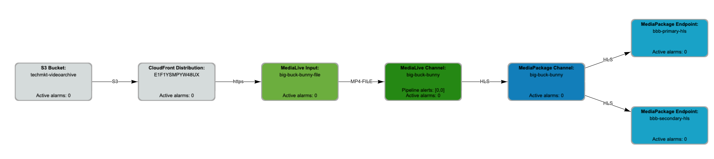
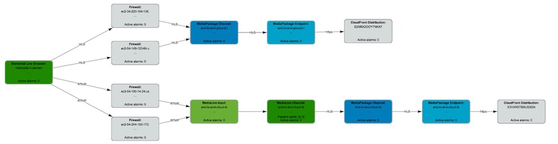
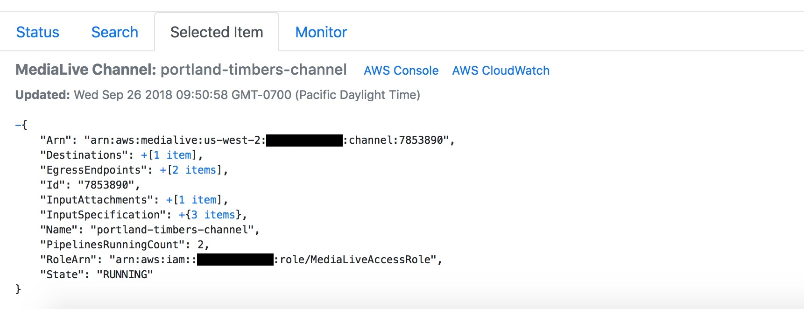
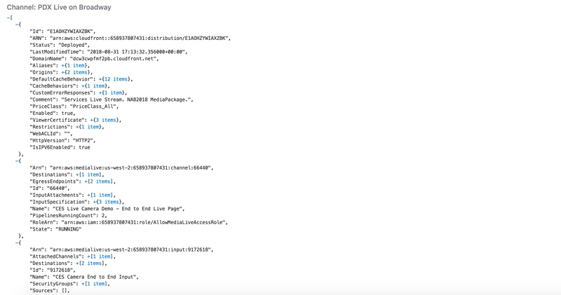
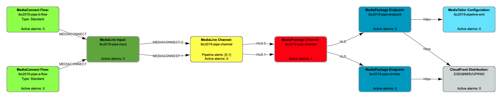
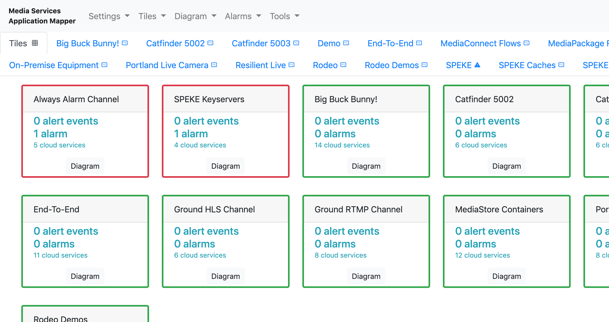

# Media Services Application Mapper (MSAM)

### Installing MSAM? Use the detailed [installation instructions](INSTALL.md).

### Already using MSAM? Please [take our survey](https://amazonmr.au1.qualtrics.com/jfe/form/SV_cBbBD6QulbrGdyl) and tell us how it's working for you.

## Overview

* MSAM is a browser-based tool that allows operators to visualize the structure and logical connections among AWS Media Services and supporting services in the cloud
* MSAM can be used as a top-down resource monitoring tool when integrated with CloudWatch
* MSAM is installed into an AWS account with several CloudFormation templates

### Diagrams

* The user builds one or more diagrams with discovered resources from their AWS account. Diagram contents can be organized in any way that makes sense for the user's environment.

* The tool visualizes cloud resources as nodes and logical connections between resources as directed edges

* Edges (connections) on diagrams generally represent some type of data flow

 
* Simple and complex workflows of Media Services resources can be discovered and represented
* Different types of service resources are visualized with unique color and textual indicators
* MSAM includes graphical tools to quickly build diagrams of related resources

The following image shows a diagram with several workflows including resources for AWS S3 buckets, CloudFront, MediaLive, MediaStore, MediaPackage, and a SPEKE key server.

* MSAM is designed to be extended with new node types, connection discovery, visualization overlays, and tools
* Custom nodes can be added within the browser application directly, or cached into a database through a cloud-side task

The following image of an MSAM diagram shows on-premise equipment: Elemental Live encoder and several Firewalls with connectivity to cloud resources

* MSAM provides configuration data for each resource on the diagram

The following image shows the JSON configuration of a diagram node when it is selected in the diagram. This is the same configuration you would see from the response to a List or Describe API call directed to the service.

### Tiles

* The tile view aggregates several related cloud resources into a single visual item
* Tiles are often used to represent a _streaming channel_ for monitoring
* Tiles can be created interactively, or through the REST API for bulk operations

The following image shows a tile view with several tiles. Each tile indicates the number of alerts and alarms aggregated from the underlying resources associated with the tile. Each tile also provides navigation back to the tile's resources on the diagram.

* The tile view displays the aggregated media service configuration information for all resources included in the tile

The following image shows the aggregated JSON configuration of all the diagram elements assigned to the tile.

### Resource Monitoring

* MSAM can be configured to automatically display MediaLive and MediaConnect pipeline alerts on those nodes
* The tool integrates with CloudWatch alarms to indicate operational problems from a top-down view
* Any CloudWatch alarm can be associated with any node on the diagram
* CloudWatch alarm indicators are visualized as color and text on the node
* CloudWatch high-resolution alarms can be used for frequent ten-second notification intervals

The following image shows MediaConnect flows sending to a MediaLive input, a MediaLive channel with an alert status on one of two pipelines shown in yellow color, and a MediaPackage channel with a custom alarm condition.

* MSAM provides three tabs in the lower compartment for Pipeline Alerts, Subscribed Alarms, and a recent CloudWatch event history. The following image shows the Pipeline Alerts tab after selecting the MediaLive channel shown above.

This image shows the Subscribed Alarms tab after selecting the MediaPackage channel shown above.

A tile aggregates all structure, configuration and status from the underlying assigned resources. If any resource's CloudWatch alarm assigned to a tile goes into alarm status, the tiles associated with that resource will also show the same status. See the image below.

### REST API

All browser actions are performed through an authenticated and SSL encrypted REST API hosted in the cloud. The API can be used by other tools to perform activities such as preloading tile definitions or adding custom content to the cache.

Further information regarding the API can be found here: [Rest API](REST_API.md)

## Navigate

Navigate to [README](README.md) | [Workshop](WORKSHOP.md) | [Install](INSTALL.md) | [Usage](USAGE.md) | [Uninstall](UNINSTALL.md) | [Rest API](REST_API.md)
