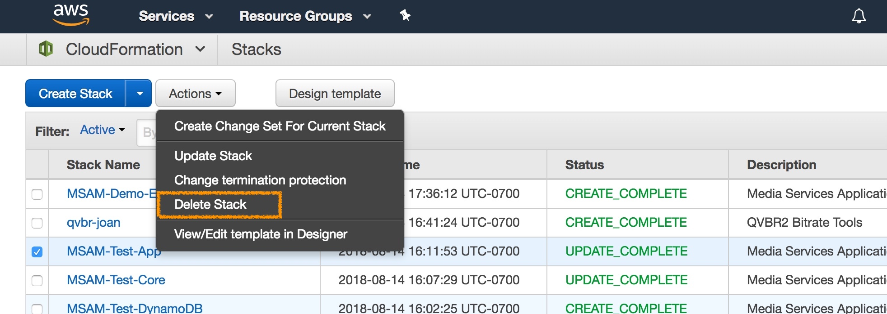

# Media Services Application Mapper (MSAM)

MSAM is removed from an AWS account using CloudFormation.

## CloudFormation Stack Deletion

### Events Stack

Delete the events stack from any other regions that were installed after you installed the main solution.

### Master Template/All Resources Stacks

If you used the **all-resources** template installation option, select the master stack in CloudFormation and click the Delete button. CloudFormation will uninstall the stacks in the opposite order they were installed.

### Individual Stacks

If you used separate templates to install the solution, be sure to delete the stacks in the opposite order they were installed.

The order in which to delete the stacks are as follows:

1. Delete MSAM Web stack 
1. Delete Event Handler stack
1. Delete Core stack
1. Delete DynamoDB stack

To delete a stack:

1. Select the template you wish to delete.
2. From the **Actions** pulldown menu, select **Delete Stack**
 

## Warning

Remember to remove the DynamoDB stack last as other stacks are running software that access the tables. Removing the tables before removing the running software has the potential to create excessive error rates in your account which may result in service usage throttling.

## Navigate

Navigate to [README](README.md) | [Workshop](WORKSHOP.md) | [Install](INSTALL.md) | [Usage](USAGE.md) | [Uninstall](UNINSTALL.md)
