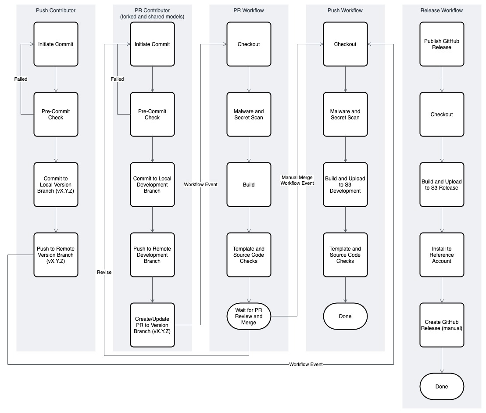

# Development Process Overview

This document describes the Media Service Application Mapper team's development process and environment. The first part of the document describes how we work with GitHub and how we manage contributions to the solution. The second part of the document describes the development environment needed to customize and build the solution.

## Issues

Use [Issues](https://github.com/awslabs/aws-media-services-application-mapper/issues) to track new features, bugs, documentation changes and anything requiring a response. The best way to contact the development team to ask a question or suggest a change is through Issues. The project team will receive a notification when a new Issue is submitted and a member will review the Issue and update the labels as needed. Watch for comments to Issues you've submitted in case a team member or other contributors needs to ask you a question or supply an answer.

## Milestones and Projects

The MSAM team uses a single [Milestone](https://github.com/awslabs/aws-media-services-application-mapper/milestones) to track the Issues included in the related release. Milestones are named *vX.Y.Z* matching the version number of the release. The team will also create a new [Project](https://github.com/awslabs/aws-media-services-application-mapper/projects) board for the release that tracks the Issues in the milestone.

## Process Chart

The image below is a process chart that shows the human and CI/CD paths through the MSAM development process. The sections that follow describe what happens during planing, development and contributing changes, and completing releases.


## Stages
### Planning and Readiness

The existing milestone for the upcoming release is reviewed and any needed adjustments are made before development starts. The Issues associated with the milestone are never final until the release completes. Changes will be made to the plan if information changes while the work is progressing.

Before development starts for a new release, the project team will create a new branch in the repository named after the version number of the release like *vX.Y.Z*. Commits are pushed to this branch during development by the project team members. The version branch will be merged into the trunk after release. Changes pushed to this branch are reviewed by team members and checked by automated workflows until it is merged back into the trunk.

### Development

During development Issues for new features and defect fixes are designed and applied to the version branch of the repository. All contributors are encouraged to seek reviews and feedback on complex changes while creating, testing and integrating them with the project. Every change does not require a review. Submission of a pull-request implies a review request. Consider your colleagues' availability and request a review when it will create a positive impact on your design or encourage a teaching situation from which others can learn and benefit.

#### Contributions by Team Members

Project team members have permissions to push directly to the version branch during development. It is up to the committing team member to push their change directly to the version branch being developed or commit your change to an isolated branch and send it as a pull-request to the version branch. This is often the case when the developer would like to request a review from one or more team members. 

#### Contributions by Everyone Else

Contributions via pull-requests are much appreciated. Before sending us a pull-request, please ensure that:

1. You are working against the latest source on the *vX.Y.Z* branch under development.
2. You check existing open and recently updated issues to make sure someone else hasn't addressed the need already.
3. Contact a team member to discuss your proposed changes, or comment on an existing issue that you would like to help on. Let us know you're trying to help.

To send us a pull-request, please:

1. Fork the repository.
2. Modify the source; please focus on the specific change you are contributing. Please avoid reformatting all the code, it will be hard for us to focus on your change.
3. Ensure you can build and test in your account.
4. Commit to your fork using an informative commit messages.
5. Create a pull-request from your fork to the version branch currently in development (vX.Y.Z). Please avoid sending pull-requests to the truck of the repository.
6. Pay attention to any automated CI failures reported on the pull-request in the upstream MSAM repository.
7. You may be asked to make adjustments to your pull-request so we can merge your contribution into the branch. Stay involved in the conversation.

GitHub provides additional document on [forking a repository](https://help.github.com/articles/fork-a-repo/) and 
[creating a pull-request](https://help.github.com/articles/creating-a-pull-request/).

#### Commit Messages in Contributions

Please always reference an existing Issue when providing a commit message by adding the Issue number to the message. GitHub can parse the #NNN issue number (hash symbol included) in the message and provide navigation between the commit and the related Issue.

#### Re-Scoping the Milestone

During the development stage we may discover that effort required for a change it too great or we need to decompose the change into several smaller changes. We will re-scope and move Issues between milestones if the team believes the current scope of the release is at risk, too large, or has exposed a technical problem requiring more time.

### Release

Once the team has addressed the Issues included in the Milestone, the project team will meet and decide if we are ready for the release. We review the Issues, documentation, and testing results before deciding to release.

Issues related to the release are closed. The milestone is closed. The version branch in the repository is merged to the trunk, and a fresh build is generated and placed into the release locations for distribution.

The [CHANGELOG.md](../CHANGELOG.md) file is updated and the [Releases](https://github.com/awslabs/aws-media-services-application-mapper/releases) listing on GitHub will show similar information.


## Development Environment

This section describes the dependencies and tools required to build and test custom versions of MSAM.

### Building

* Install/update to Python 3.x
* Install the AWS Command Line Interface (CLI)
* Create a Python [virtual environment](https://docs.python.org/3.8/library/venv.html) using [requirements.txt](deployment/requirements.txt) and activate it
* Configure the bucket name of your target Amazon S3 distribution bucket

### Recommended Security Tools

#### [truffleHog](https://github.com/dxa4481/truffleHog)

This is a tool that scans the git repository for various secrets and token patterns, like SSH, AWS, Facebook, Google, and Microsoft keys and tokens.

Run truffleHog from the root folder of your repository with the following command:

```
trufflehog --regex --entropy=False .
```

The tool will output any potential findings.

### Recommended Git Hooks

#### [awslabs/git-secrets](https://github.com/awslabs/git-secrets)

Similar to truffleHog, this is a tool that prevents you from committing secrets and credentials into git repositories.

After you install this tool into your system, run these commands from the root folder of your forked or cloned repository:

```
git secrets --install
git secrets --register-aws
```

You will see messages like:

```
✓ Installed commit-msg hook to [...]/.git/hooks/commit-msg
✓ Installed pre-commit hook to [...]/.git/hooks/pre-commit
✓ Installed prepare-commit-msg hook to [...]/.git/hooks/prepare-commit-msg
```

This tool will be used before a commit to check your incoming changes for secrets. When configured as a git hook, the commit will be prevented if any potentially sensitive data is detected.

### Continuous Integration and Deployment (CI/CD)

The project uses several Actions workflows that respond to GitHub events including push and pull-requests, and manually initiated workflows for creating a new release.

If you are working from a fork of the MSAM repository, you will also receive the `.github` folder with the existing workflows of that branch. The forked repository will not receive the secrets used to upload the completed build to the storage area for manually testing deployments.

