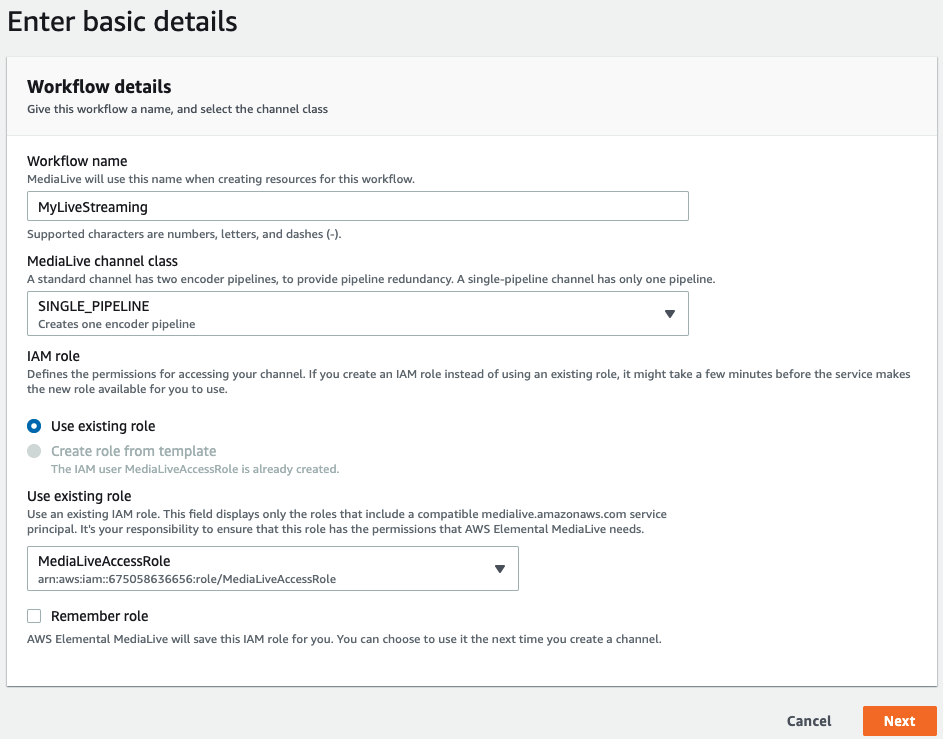
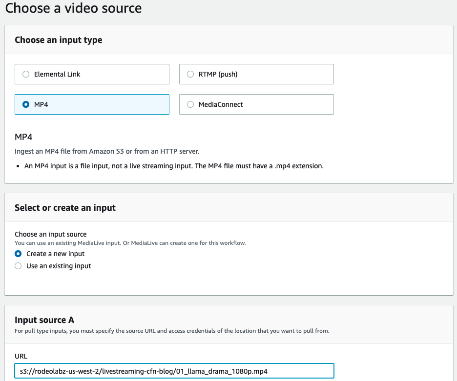
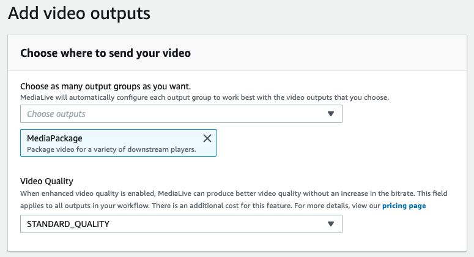
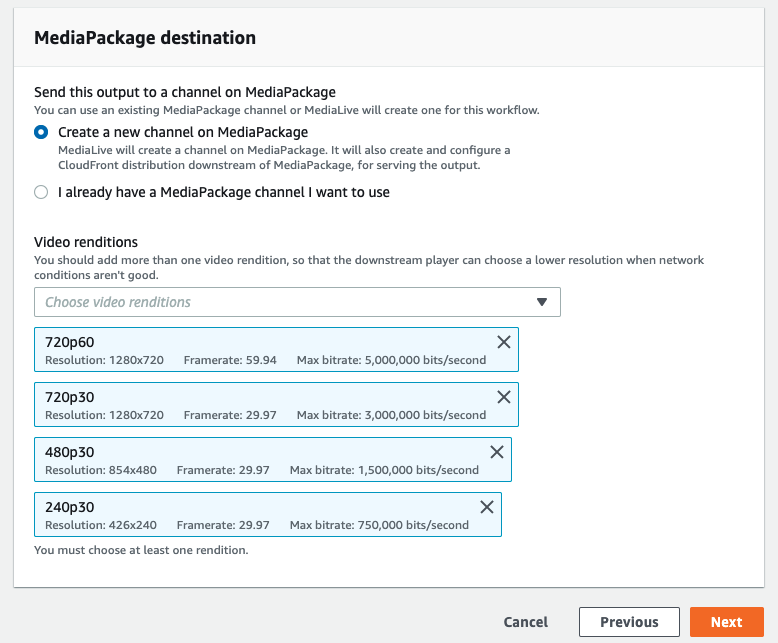
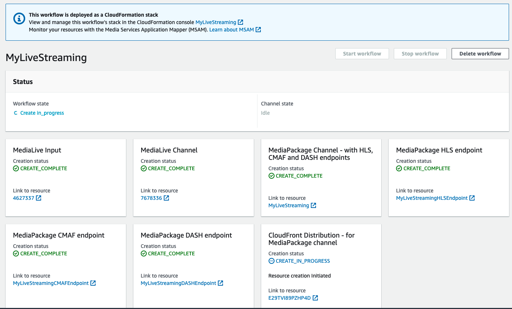
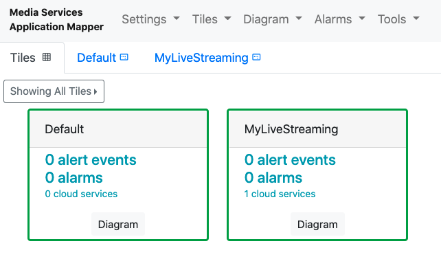

# Monitoring a live streaming workflow created by the MediaLive wizard

MediaLive now has a [Workflow Wizard](https://docs.aws.amazon.com/medialive/latest/ug/wizard.html) that guides the user in creating a live streaming workflow. The resources created by the wizard get tagged with the `MSAM-diagram` and `MSAM-tile` keys with the workflow name as values (see MSAM's [resource tagging doc](RESOURCE_TAGS.md)). MSAM uses these tags to automatically create a diagram and tile that can then be used to monitor the workflow. 

Here, we'll show you the end-to-end process of creating a live streaming workflow using the MediaLive Workflow Wizard, and monitoring it with MSAM. 

## Create a live streaming workflow
Navigate to the MediaLive console's [Workflow Wizard](https://us-west-2.console.aws.amazon.com/medialive/home?region=us-west-2#!/workflows).

### Enter basic details 
1. Click on **Create workflow**.
1. Give the workflow a name like `MyLiveStreaming`.
1. Under **MediaLive Channel Class**, select `SINGLE_PIPELINE`.
1. Under **IAM Role**, choose an existing role from the dropdown. If no existing role exists, follow instructions [here](https://docs.aws.amazon.com/medialive/latest/ug/role-and-remember-arn.html) on how to create a role. 
1. Click **Next**.

    

### Choose a video source
1. Under **Choose an input type**, select `MP4`.
1. Under **Choose an input source**, select `Create a new input`.
1. Under **Input source A**, enter the following URL: `s3://rodeolabz-us-west-2/livestreaming-cfn-blog/01_llama_drama_1080p.mp4`
1. Click **Next**.
    
    

### Add video outputs
1. Under **Choose where to send your video**, select `MediaPackage`.
1. You may remove video renditions you don't want, or simply leave the selected defaults under **MediaPackage destination**. 
1. Click **Next**. 

    
    

### Review and create resources
1. Click **Create workflow resources**. 

    

NOTE: Depending on the region you've created the worfkflow, it could take anywhere from 5-40 minutes for the wizard to get into a complete state as it waits for CloudFront to get fully deployed.

## Install MSAM to monitor the workflow

If you already have an existing MSAM installation, then move on to the next section. Otherwise, follow the instructions [here](INSTALL.md) on how to install MSAM.

## Monitor the workflow
Give MSAM a few minutes to scan your account for new inventory created by the Workflow Wizard. 

1. Bring up the MSAM browser app (refer to the [Usage guide](USAGE.md) if this the first time you've installed MSAM).
1. You should see a tile named `MyLiveStreaming` (or whatever name you've given your workflow) as well as a diagram of the same name. If you don't see the tile and diagram, give MSAM a few more minutes to scan the account for new resources. 

    

1. Click on the `MyLiveStreaming` diagram. It might look like only one resource is on the diagram, but all associated media services should be on there and merely needs to be properly laid out. 
1. Click on the `Diagram` menu, select `Layout Hierarchical Left-Right`. 
  
    

    Without any further configuration, MSAM receives pipeline events from MediaLive and will display those by changing the visual representation of the MediaLive node on the diagram. To further customize your tile and diagram, refer to the [Usage guide](USAGE.md). 
