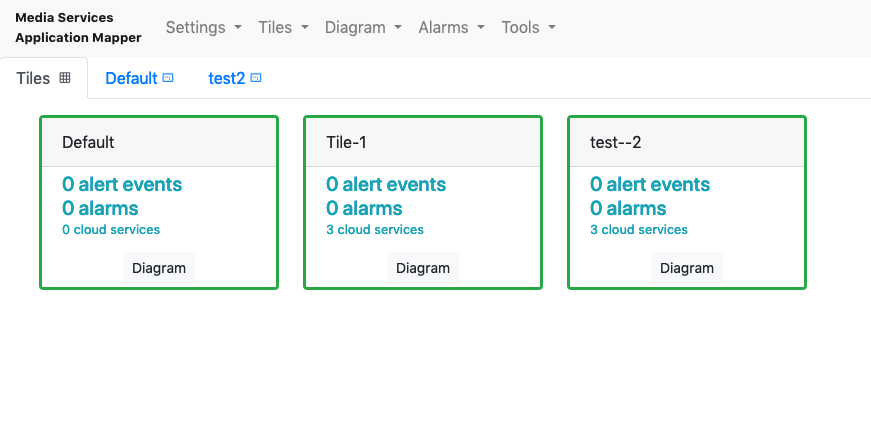
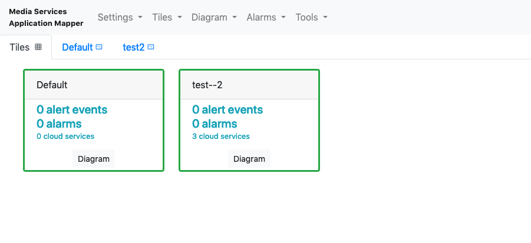

# REST API

## Amazon API Gateway
Some information regarding the API can be found in the API Gateway. 
* Using the Services menu in the AWS Console navigate to CloudFormation
* In the stacks listing, choose the MSAM nested stack containing the name CoreModuleStack
* Select the Resources tab on the page
* Find the resource with the logical ID RestAPI and the type AWS::ApiGateway::RestApi
* Click the physical ID link
* Choose 'Documentation' at the left side


Each API call is represented by a block and each block has a _summary_ which can give you some idea as to what options are available from this API.

**To make any MSAM API call, you will need both the REST API endpoint and API key for your installation.** Anywhere you see MSAM_EndpointUrl and MSAM_APIKey in the examples below, replace them with your REST API endpoint and API key, respectively. See the [Install](INSTALL.md) document on how to retrieve this information.

## Tile View Example

### Adding a Channel to the Tile View
Channels, or blocks, on the Tile View can represent multiple things, but a common use of grouping items together because the items represent a single entity, a _streaming channel_. This Channel might include: a MediaLive Input, a MediaLive Channel, and a MediaStore Container.

Given that example: (MediaLive Input -> MediaLive Channel -> MediaStore Container) here's how to place those items into a Channel in the Tile View.


To add a _streaming channel_ to the Tile View you must first decide on a name for the "channel" - in the example below, it's 'Tile-1' (seen at the end of request URL)
the following command should work on Linux/Mac terminals. Windows users replace '\' at the end of the line with '^'.
```
curl --location --request POST 'https://<MSAM_EndpointUrl>/msam/channel/Tile-1' \
--header 'x-api-key: <MSAM_APIKey>' \
--header 'Content-Type: application/json' \
--data-raw '[
	"arn:aws:medialive:us-west-2:<AWS-Account-Number>:channel:<MediaLive-ID-number>",
	"arn:aws:medialive:us-west-2:<AWS-Account-Number>:input:<MediaLive-Input-ID-number>",
	"arn:aws:mediastore:us-west-2:<AWS-Account-Number>:container/<MediaStore-Container-Name>"
]'
```
The response from the command line should be:
`{"message":"saved"}`

From here you can refresh your browser and you will see the new Channel appear on the Tile View.


From the example above you might notice that the "--raw-data", parameter is what generates the items in your new Channel. It's a list of the ARN numbers for those AWS objects.  This "raw-data" can be a single arn number or multiple arn numbers in json format.

### Deleting a Channel from the Tile View
This operation requests the same URL, however the key difference is what Type of request it is, in this case as opposed to `Post` this is a `Delete`
```
curl --location --request DELETE 'https://<MSAM_EndpointUrl>/msam/channel/Tile-1' \
--header 'x-api-key: <MSAM_APIKey>'
```
The response from the command line should be
`{"message":"done"}`

From here you can refresh your browser and you should see that 'Tile-1' has been removed


## MSAM User Defined Nodes

### Setup

Decide on the nodes, type of data they contain, and how they will connect to other nodes in the inventory.

### Construct the node data in a .json file

```
[{
    "arn": "arn:msam:user-defined-node:global:364349932524:207C7C03-61CE-4075-BAF6-B808C9F80C0D",
    "color": "#1E8900",
    "data": "{ \"NodeType\": \"Elemental Live Encoder\", \"Id\": \"contribution-stream-A\" }",
    "expires": 1741734757,
    "region": "global",
    "service": "user-defined-node",
    "updated": 1741734757
},
{
    "arn": "arn:msam:user-defined-node:global:364349932524:10AA8D40-2B6F-44FA-AA67-6B909F8B1DB9",
    "color": "#1E8900",
    "data": "{ \"NodeType\": \"Elemental Live Encoder\", \"Id\": \"contribution-stream-B\" }",
    "expires": 1741734757,
    "region": "global",
    "service": "user-defined-node",
    "updated": 1741734757
}
]
```

The above JSON fragment shows two user-defined nodes representing on-premise video encoders. Note the surrounding array, and each node is a separate object. You can construct custom ARNs to identify user-defined nodes. Use the format established by AWS for your ARNs. These values are only for identification within the tool and not within the AWS cloud.

### Construct connections (edges) to other nodes (if applicable) in .json file

```
[{
    "arn": "arn:msam:user-defined-node:global:364349932524:56F67EE2-186F-446A-ACFF-1B56900B2F68:arn:msam:user-defined-node:global:364349932524:207C7C03-61CE-4075-BAF6-B808C9F80C0D",
    "expires": 1741734757,
    "from": "arn:msam:user-defined-node:global:364349932524:56F67EE2-186F-446A-ACFF-1B56900B2F68",
    "label": "HQ Stream A",
    "region": "global",
    "service": "user-defined-connection",
    "to": "arn:msam:user-defined-node:global:364349932524:207C7C03-61CE-4075-BAF6-B808C9F80C0D",
    "updated": 1741734757
},
{
    "arn": "arn:msam:user-defined-node:global:364349932524:56F67EE2-186F-446A-ACFF-1B56900B2F68:arn:msam:user-defined-node:global:364349932524:10AA8D40-2B6F-44FA-AA67-6B909F8B1DB9",
    "expires": 1741734757,
    "from": "arn:msam:user-defined-node:global:364349932524:56F67EE2-186F-446A-ACFF-1B56900B2F68",
    "label": "HQ Stream B",
    "region": "global",
    "service": "user-defined-connection",
    "to": "arn:msam:user-defined-node:global:364349932524:10AA8D40-2B6F-44FA-AA67-6B909F8B1DB9",
    "updated": 1741734757
}]
```

### Send the user-defined nodes and connections to the API

The HTTPie or Curl tools can be used here. The following example uses HTTPie.


http POST <MSAM_EndpointUrl>/cached "x-api-key: <MSAM_APIKey> < **JSON_FILE**

You will receive an acknowledgment from the API.

## Node alarm subscription

### Setup
1. Identify the node ARN(s) that should be subscribed to an alarm
1. Identify the alarm name and its region that should be subscribed to the node

### Send the alarm subscription to the API

Execute the following curl POST command where Alarm_Name is the URL encoded name of the alarm and Region is the AWS region where the alarm was created. 
The data parameter is a JSON array of node ARNs to be subscribed to the alarm. Subscribing multiple nodes to the same alarm would look like: ["NODE_ARN","NODE_ARN","NODE_ARN"]

```
curl -X POST -H "content-type:application/json" \
	-H "x-api-key: <MSAM_APIKey>" \
	-d '["NODE_ARN"]' \
    <MSAM_EndpointUrl>/cloudwatch/alarm/<Alarm_Name>/region/<Region>/subscribe
```


## Other API Commands
The best way to understand the existing API commands is to navigate to the MSAM web page, open up developer tools in your web browser of choice and look through the 'Network' tab. From there you'll be able to see the commands being sent from your browser to the website.


## Navigate

Navigate to [README](../README.md) | [Architecture](ARCHITECTURE.md) | [Workshop](WORKSHOP.md) | [Install](INSTALL.md) | [Usage](USAGE.md) | [Uninstall](UNINSTALL.md) | [Contributing](../CONTRIBUTING.md)