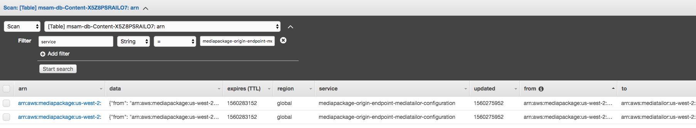

# Extending MSAM with New AWS Services
This guide will walk you through the basics of extending the Media Services Application Mapper to discover and visualize other AWS services. It assumes that you have the MSAM CloudFormation stacks already deployed and running, and that you have launched the MSAM browser at least once before to view the services in your account. AWS Elemental MediaTailor will be used as an example throughout the guide.

## Discovering the Service
Presumably, you've already identified an AWS service you want to add to the Media Services Application Mapper. It may not necessarily be an AWS Media Service, but logically interacts with one of the Media Services. 

Since MSAM is implemented using Python, it uses the boto3 library to query for the presence of a particular service in a user's AWS account. 

The code that discovers and caches the services (also referred to here as nodes) is in the [nodes.py](../source/msam/chalicelib/nodes.py) file. 

1. Edit the [nodes.py](../source/msam/chalicelib/nodes.py) file.
1. Define a function that lists all instantiations of your service in a given region.

    In the case of AWS Elemental MediaTailor, the `list_playback_configurations` API call gives us all the configurations available in a given region. 

    ```
    def mediatailor_configurations(region):
        """
        Return the MediaTailor configurations for the given region.
        """
        service = boto3.client('mediatailor', region_name=region)
        response = service.list_playback_configurations()
        configs = response['Items']
        ...
    ```
1. Define a function that iterates over the discovered instances of your service and formats it for storage in DynamoDB. You will need:
    *  the ARN of the service - this is used as the primary partition key for the service item in the database
    *  service name - how you want to identify this particular service
    * region 
    * config - all the metadata you want to store about the service; this data is usually present as part of the return value of the call to list the existing definitions of the service

    ```
    def mediatailor_configuration_ddb_items(region):
    """
    Retrieve and format MediaTailor configuration for cache storage.
    """
        items = []
        for config in mediatailor_configurations(region):
            arn = config["PlaybackConfigurationArn"]
            service = "mediatailor-configuration"
            items.append(node_to_ddb_item(arn, service, region, config))
        return items
    ```

1. If your service is regional (unlike S3 or CloudFront which are global), call the above function in the `update_regional_ddb_items(region_name)` function using the `put_ddb_items` function in order to save the defined node items in the database.

    ```
    def update_regional_ddb_items(region_name):
    """
    Update all services in the cache for a region.
    """
        try:
            content.put_ddb_items(mediatailor_configuration_ddb_items(region_name))
        except ClientError as error:
                print(error)
    ...
    ```
    MSAM will handle iterating over all the regions to check for your service.


### Testing Your Code

Before going any further, check to make sure that your nodes are making their way into the database.

1. Edit [policy-dev.json](../source/msam/.chalice/policy-dev.json) and grant the Lambda that will use the code you've written the rights to list out or describe your service.
    ```
        "Statement": [{
            "Action": [
                ...
                "mediatailor:Get*",
                "mediatailor:List*"
            ],
            "Effect": "Allow",
            "Resource": "*"
        },
        ...
    ```
2. Review [README.md](../README.md#build) on instructions to create a custom build of MSAM.
3. Run [build-s3-dist.sh](../deployment/build-s3-dist.sh). This will produce a zip file called `regional-s3-assets/core_NNNNNNNNNN.zip`.
4. Update your __<stackname_>-UpdateNodes-_<randomstring_>_ Lambda to use this new code by uploading the zip file and saving the Lambda.
5. After a few minutes, verify that you are seeing your service in the Content table:
    

6. If you don't see any of your nodes in the database, check CloudWatch for potential errors in your UpdateNodes Lambda.    

## Defining Connections with the Service 
Once you've successfully discovered and stored all the existing definitions of your service, you need to figure out the connection points of your service with other AWS Media Services or AWS services.

For MediaTailor, the connection to other services is through the video source (origin) that it takes in as a configuration parameter. The video source could come from AWS Elemental MediaPackage, AWS Elemental MediaStore, or S3. These three connections will have to be defined separately, as its own function in the [connections.py](../source/msam/chalicelib/connections.py) file. 

1. Define your connection function. The function follows the nomenclature: _fromservice_toservice_ddb_items()_.  The connection type name follows the nomenclature: _fromservice_toservice_. The example below shows the connection from MediaPackage to MediaTailor. 
    ```
    def mediapackage_endpoint_mediatailor_configuration_ddb_items():
    """
    Identify and format MediaPackage endpoints to a MediaTailor configuration for cache storage.
    """
    items = []
    connection_type = "mediapackage-origin-endpoint-mediatailor-configuration
    try:
        mediapackage_ep_cached = cache.cached_by_service("mediapackage-origin-endpoint")
        mediatailor_configs_cached = cache.cached_by_service("mediatailor-configuration")        
        # get the URL from data and compare to the VideoContentSourceUrl of MediaTailor
        for mp_endpoint in mediapackage_ep_cached:
            mp_endpoint_data = json.loads(mp_endpoint["data"])
            mp_endpoint_channel_id = mp_endpoint_data["Url"]
            for mt_config in mediatailor_configs_cached:
                mt_config_data = json.loads(mt_config["data"])
                mt_config_video_source = mt_config_data["VideoContentSourceUrl"]
                if mt_config_video_source in mp_endpoint_channel_id:
                    config = {"from": mp_endpoint_data["Arn"], "to": mt_config_data["PlaybackConfigurationArn"], "scheme": urlparse(mt_config_video_source).scheme}
                    print(config)
                    items.append(connection_to_ddb_item(mp_endpoint_data["Arn"],      mt_config_data["PlaybackConfigurationArn"], connection_type, config))            
    except ClientError as error:
        print(error)
    return items
    ```
1. In the `update_connection_ddb_items` function, add a call to your function using the `put_ddb_items` function in order to save the defined connection items in the database.
    ```
    def update_connection_ddb_items():
    """
    Update all connections in the cache.
    """
    try:
        content.put_ddb_items(mediapackage_endpoint_mediatailor_configuration_ddb_items())
    ...
    ```

### Testing Your Code
Before going any further, check to make sure that your defined connection items are making their way into the database.

2. Review [README.md](../README.md#build) on instructions to create a custom build of MSAM.
3. Run [build-s3-dist.sh](../deployment/build-s3-dist.sh). This will produce a zip file called `regional-s3-assets/core_NNNNNNNNNN.zip`.
1. Update your __<stackname_>-UpdateConnections-_<randomstring_>_ Lambda to use this new code by uploading the zip file and saving the Lambda.
1. After a few minutes, verify that you are seeing your defined connections in the Content table:
    

1. If you don't see any of your connection items in the database, check CloudWatch for potential errors in your UpdateConnections Lambda.    


## Mapping the Service and its Connections

Once the node and connection discoveries are working and the items are being saved correctly in the database, it is time to make sure they show up on the MSAM diagram. 

### Mapping the Service
1. In the `html/js/app/mappers/nodes` directory, clone one of the node javascript files and rename it to reflect the service it represents. For example: [mediatailor.js](html/js/app/mappers/nodes/mediatailor.js).

1. Edit the new file you just cloned. Rename the function that updates the node representing your service. We've called this function `update_config` for MediaTailor. In MediaTailor, there is only one function to update as the configuration is the only node that's representing the service. In other services, like AWS Elemental MediaPackage, there are two: one for updating the channel, and another for updating the endpoint.  Nevertheless, in your update function, replace the server GET call with the name of the service you are adding.
    ```
    var update_configs = function(regionName) {
        ...
        server.get(url + "/cached/mediatailor-configuration/" + regionName, api_key).then(function(configs) {
        ...
        }
    }
    ```
1. In the `map_config` function, you will need to update several things including the color of the node, the node type, the console link, as well as the CloudWatch link for the service.

    ```
    ...
    var rgb = "#80e5ff"; #replace this with the color you want for your node
    ...
    var node_type = "MediaTailor Configuration"; # replace the value with your node name
    ...
    var html = `https://console.aws.amazon.com/mediatailor/home?region=${region}#/config/${name}`; #replace with the link to service console 
    ...
    var html = `https://us-west-2.console.aws.amazon.com/cloudwatch/home?region=${region}#logs:prefix=MediaTailor`; #replace with the link to your service's CloudWatch logs 
    ```
1. Edit the return call to reflect the name of the node and save the file.
    ```
    ...
    return {
            "name": "MediaTailor Configuration",
            "update": update
        };
    ```
1. Edit the [plugins.js](html/js/app/plugins.js) file. Add the node file you created to the nodes definition. Save the file.
    ```
    ...
        "nodes": [
            "app/mappers/nodes/mediatailor"
        ],
    ...
    ```


### Mapping the Connections
1. In the `html/js/app/mappers/connections` directory, clone one of the connections javascript files and rename it to reflect the connection it represents. For example: [mediapackage_endpoint_mediatailor_configuration.js](html/js/app/mappers/connections/mediapackage_endpoint_mediatailor_configuration.js).
1. Edit the new file you just cloned. In the `update_connections` function, replace the server GET call to the connection you are mapping.
    ```
    ...
    server.get(url + "/cached/mediapackage-origin-endpoint-mediatailor-configuration/global", api_key).then((connections) => {
        ...
    }
    ```
1. Edit the return call to reflect the connection and save the file.
    ```
    ...
    return {
            "name": "MediaPackage Endpoint to MediaTailor Configuration",
            "update": update
        };

    ```
1. Repeat steps 1-3 for each of the connections you have defined for your service.
1. Edit the [plugins.js](html/js/app/plugins.js) file. Add the connection files you created to the collections definition. Save the file.
    ```
    ...
    "connections": [
        "app/mappers/connections/mediapackage_endpoint_mediatailor_configuration",
        "app/mappers/connections/s3_bucket_mediatailor_configuration",
        "app/mappers/connections/mediastore_container_mediatailor_configuration"
    ],
    ...
    ```

### Defining the Overlay
1. In the `html/js/app/ui/overlays` directory, clone one of the overlay javascript files and name it to reflect the connection it represents. For example: [mediatailor_configuration.js](html/js/app/ui/overlays/mediatailor_configuration.js).
1. Edit the new file you just cloned. Update the _match_type_ variable to reflect the service you are adding. Save the file.
    ```
        var match_type = "MediaTailor Configuration";
    ```
1. Edit the [plugins.js](html/js/app/plugins.js) file. Add the overlay file you created to the overlays definition. Save the file.
    ```
    ...
    "overlays": [
        "app/ui/overlays/mediatailor_configuration"
    ]
    ...
    ```

### Testing Your Code

Now that the visualization portion of the code has been completed, you will need to update the javascript files that are currently deployed in your MSAM S3 bucket. Once updated, launch MSAM in your browser to actually view the diagram with the service you just added.

1. From the CloudFormation console, go to the Resources tab of your MSAM application stack. Click on the MSAMBrowserAppBucket.
1. Add all the new and modified javascript files back into the `js` folder of the bucket. Make sure to put them in the same folder/directory as you have them in your repository.
1. Make the new and modified files public, otherwise, the browser will fail to fetch and run them. 
1. Back in the CloudFormation console, go to the Outputs tab of your MSAM application stack and click on the MSAMBrowserURL.
1. When prompted, enter the Endpoint URL and API key. Refer to the [Usage Guide](USAGE.md) if you need a refresher on launching MSAM.
1. You may have to refresh the nodes in your tiles in order to see the new nodes and connections. From your tile:
    * Click on the Diagram menu 
    * Choose Manage Diagram Contents
    * From the inventory, look for the nodes representing your service and add them to the diagram. Hit Save.
1. If you don't see your service in the inventory, check the browser console for any errors. 

    

Navigate to [README](../README.md) | [Architecture](ARCHITECTURE.md) | [Workshop](WORKSHOP.md) | [Install](INSTALL.md) | [Usage](USAGE.md) | [Uninstall](UNINSTALL.md) | [Rest API](REST_API.md) | [Contributing](../CONTRIBUTING.md)
